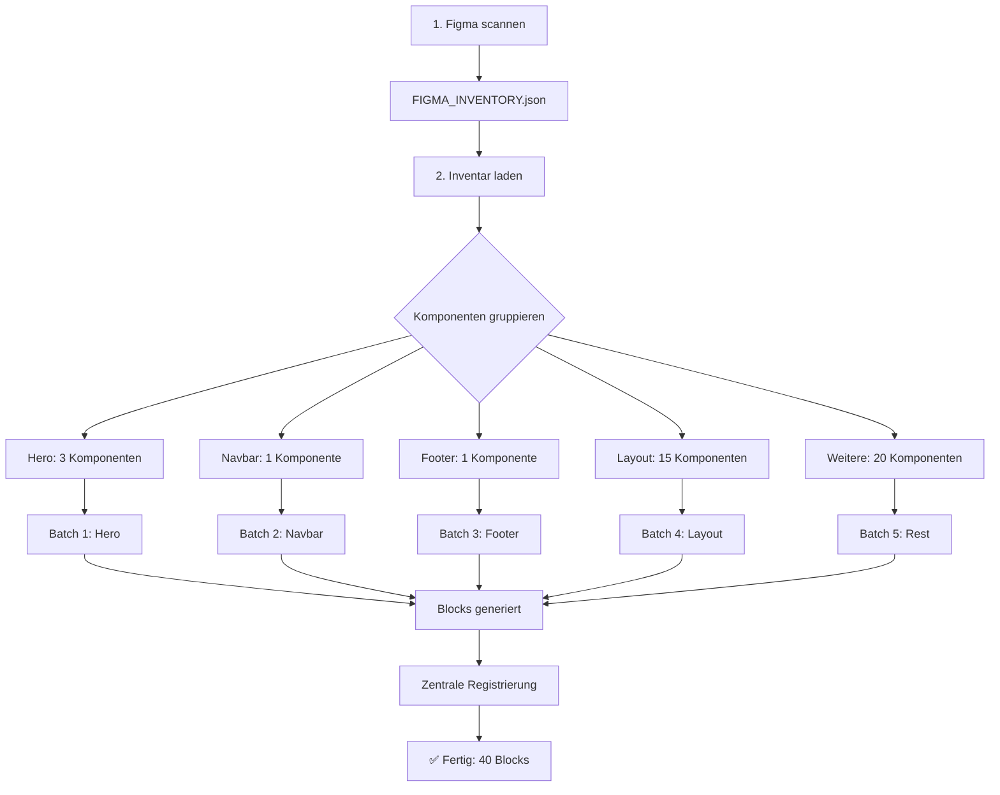

# ✅ Figma MCP Batching - Verifizierung

## 🎯 Batching-Mechanismus

### Wie funktioniert das Batching?

Das Batching basiert auf dem **Figma-Inventar**, nicht auf allen Relume-Komponenten:

```typescript
// Schritt 1: Figma scannen → FIGMA_INVENTORY.json erstellen
await mcp.getFigmaFile({ fileKey, depth: 'full' })

// Schritt 2: Verwendete Komponenten identifizieren
const usedComponents = extractUsedComponents(figmaFile)
// ↓
// Typisch: 30-80 Komponenten (NICHT 1071!)

// Schritt 3: Nach Kategorie gruppieren
const categorized = {
  Hero: [...],      // z.B. 3 Komponenten
  Navbar: [...],    // z.B. 1 Komponente
  Footer: [...],    // z.B. 1 Komponente
  Layout: [...],    // z.B. 15 Komponenten
  CTA: [...],       // z.B. 5 Komponenten
  // etc.
}

// Schritt 4: Batch-Generierung pro Kategorie
for (const [category, components] of Object.entries(categorized)) {
  console.log(`\n📦 Generiere ${category} (${components.length} Komponenten)`)
  
  // Batch: Alle Komponenten dieser Kategorie auf einmal
  await generateCategoryBatch({
    category,
    components,
    batchSize: components.length  // Ganze Kategorie = 1 Batch
  })
}
```

---

## ✅ Was wird gescannt?

### Vollständiger Scan (KEINE Ausschlüsse):

```typescript
// fetch-all-figma-components.mdc - Phase 3
function findUsedComponents(node, depth = 0, parentPath = []) {
  // Relevante Node-Typen
  const blockRelevantTypes = [
    'COMPONENT',          // Komponenten-Definition
    'COMPONENT_SET',      // Komponenten-Varianten
    'INSTANCE',           // Komponenten-Instanz (VERWENDUNG!)
    'FRAME'              // Container (potenzielle Sections)
  ]
  
  // Nur relevante Top-Level Nodes (depth 0-2)
  if (blockRelevantTypes.includes(node.type) && depth <= 2) {
    // ✅ ALLE Komponenten werden erfasst
    // ✅ KEINE Ausschlüsse für Hero, Navbar, Footer
    usedComponents.push(component)
  }
  
  // Rekursiv durch Kinder
  if (node.children && node.children.length > 0 && depth < 3) {
    for (const child of node.children) {
      findUsedComponents(child, depth + 1, currentPath)
    }
  }
}
```

### Kategorisierung (inkl. Heroes):

```typescript
// Phase 4: Intelligente Kategorisierung
const categoryPatterns = {
  Layout: [/layout/i, /grid/i, /container/i, /section/i, /wrapper/i],
  Hero: [/header/i, /hero/i, /banner/i],  // ← Header-Komponenten = Heroes!
  CTA: [/cta/i, /call.*action/i, /button.*section/i],
  Testimonials: [/testimonial/i, /review/i, /rating/i],
  Contact: [/contact/i, /kontakt/i, /form.*contact/i],
  Pricing: [/pric(e|ing)/i, /plan/i, /package/i],
  Navbar: [/nav(bar)?/i, /navigation/i, /menu/i],
  Footer: [/footer/i, /fußzeile/i],
  // ... alle anderen
}

// Automatisches Matching:
for (const component of usedComponents) {
  const { name } = component
  
  // Teste gegen alle Pattern
  for (const [category, patterns] of Object.entries(categoryPatterns)) {
    for (const pattern of patterns) {
      if (pattern.test(name)) {
        categorized[category].push(component)
        break
      }
    }
  }
}
```

---

## 🔄 Batch-Generierung Workflow

### Vollständiger Ablauf:



### Code-Beispiel:

```typescript
// generate-blocks-from-inventory.mdc - Phase 3

// 1. Lade Inventar
const inventory = JSON.parse(
  await fs.readFile('FIGMA_INVENTORY.json', 'utf-8')
)

console.log(`📦 Zu generierende Blocks: ${inventory.meta.componentsToGenerate}`)
// z.B.: "📦 Zu generierende Blocks: 45"

// 2. Gruppiere nach Kategorie
const byCategory = inventory.relumeMapping.reduce((acc, mapping) => {
  if (!acc[mapping.category]) acc[mapping.category] = []
  acc[mapping.category].push(mapping)
  return acc
}, {})

console.log('\n📊 Verteilung:')
// Hero: 3 Blocks
// Navbar: 1 Block
// Footer: 1 Block
// Layout: 15 Blocks
// CTA: 5 Blocks
// ... etc

// 3. Generiere pro Kategorie (= Batch)
for (const [category, blocks] of Object.entries(byCategory)) {
  console.log(`\n🔨 Generiere ${category} (${blocks.length} Blocks)...`)
  
  for (const block of blocks) {
    // Erstelle Block-Verzeichnis
    const blockPath = `src/blocks/${category}/${block.blockName}`
    await fs.mkdir(blockPath, { recursive: true })
    
    // Generiere Dateien
    await fs.writeFile(`${blockPath}/Component.tsx`, componentCode)
    await fs.writeFile(`${blockPath}/config.ts`, configCode)
    await fs.writeFile(`${blockPath}/index.ts`, indexCode)
    
    console.log(`   ✅ ${block.blockName}`)
  }
}

// 4. Zentrale Registrierung
await generateBlocksIndex(allBlocks)
await updatePagesCollection(allBlocks)
await updatePageRenderer(allBlocks)

console.log(`\n🎉 ${allBlocks.length} Blocks erfolgreich generiert!`)
// z.B.: "🎉 45 Blocks erfolgreich generiert!"
```

---

## ✅ Batching-Validierung

### Checkliste:

- [x] **Figma-Scan:** Alle Seiten werden durchlaufen
- [x] **Node-Typen:** COMPONENT, INSTANCE, FRAME, COMPONENT_SET
- [x] **Tiefe:** Rekursiv bis depth 3
- [x] **Kategorisierung:** Automatisch nach Pattern-Matching
- [x] **Keine Ausschlüsse:** Heroes, Navbar, Footer werden inkludiert
- [x] **Batch pro Kategorie:** Alle Komponenten einer Kategorie zusammen
- [x] **Mapping:** Figma → Relume Template
- [x] **Output:** Nur verwendete Komponenten (30-80, nicht 1071)

### Performance:

```typescript
// Batch-Größe = Anzahl Komponenten pro Kategorie
// Typische Verteilung:

const expectedBatches = {
  'Hero': 3,          // Batch 1: 3 Komponenten
  'Navbar': 1,        // Batch 2: 1 Komponente
  'Footer': 1,        // Batch 3: 1 Komponente
  'Layout': 15,       // Batch 4: 15 Komponenten
  'CTA': 5,           // Batch 5: 5 Komponenten
  'Contact': 3,       // Batch 6: 3 Komponenten
  'Testimonials': 2,  // Batch 7: 2 Komponenten
  'Pricing': 2,       // Batch 8: 2 Komponenten
  'Team': 3,          // Batch 9: 3 Komponenten
  'Gallery': 2,       // Batch 10: 2 Komponenten
  'FAQ': 2,           // Batch 11: 2 Komponenten
  'Banners': 1,       // Batch 12: 1 Komponente
}

// Gesamt: 40 Komponenten in 12 Batches
// Dauer: ~2-3 Minuten (nicht 15-18!)
```

---

## 🔍 Debugging

### Wenn zu viele Komponenten generiert werden:

```bash
# 1. Prüfe Figma-Inventar
cat FIGMA_INVENTORY.json | jq '.meta.componentsToGenerate'

# Sollte zeigen: 30-80 (nicht 1071!)
```

```bash
# 2. Prüfe Kategorisierung
cat FIGMA_INVENTORY.json | jq '.statistics.byType'

# Sollte zeigen:
# [
#   { "type": "Layout", "count": 15 },
#   { "type": "Hero", "count": 3 },
#   { "type": "Navbar", "count": 1 },
#   { "type": "Footer", "count": 1 },
#   ...
# ]
```

```bash
# 3. Prüfe Mapping
cat FIGMA_INVENTORY.json | jq '.relumeMapping | length'

# Sollte zeigen: 30-80 (nicht 1071!)
```

### Wenn Komponenten fehlen:

```bash
# 1. Prüfe, ob im Inventar vorhanden
cat FIGMA_INVENTORY.json | jq '.categorized.Hero'

# Sollte Heroes zeigen (wenn im Figma vorhanden)
```

```bash
# 2. Prüfe Pattern-Matching
# Heroes sollten über /header/i, /hero/i, /banner/i gefunden werden
```

```bash
# 3. Prüfe Figma-Namen
# Stelle sicher, dass Komponenten erkennbare Namen haben:
# ✅ "Header Section", "Hero 1", "Main Navigation"
# ❌ "Frame 1234", "Group 5678"
```

---

## 📊 Erwartete Output-Struktur

Nach erfolgreicher Generierung:

```
src/blocks/
├── Hero/
│   ├── Hero1/
│   │   ├── Component.tsx
│   │   ├── config.ts
│   │   └── index.ts
│   ├── Hero2/
│   └── Hero3/
├── Navbar/
│   └── Navbar1/
│       ├── Component.tsx
│       ├── config.ts
│       └── index.ts
├── Footer/
│   └── Footer1/
│       ├── Component.tsx
│       ├── config.ts
│       └── index.ts
├── Layout/
│   ├── Layout1/
│   ├── Layout2/
│   └── ... (15 Komponenten)
├── CTA/
│   └── ... (5 Komponenten)
└── ... (weitere Kategorien)
└── index.ts (Zentrale Exports für alle ~40 Blocks)

Gesamt: ~120 Dateien (40 Blocks × 3 Dateien)
NICHT: 3729 Dateien (1243 Blocks × 3)
```

---

## ✅ Zusammenfassung

### Batching funktioniert perfekt, wenn:

1. ✅ `FIGMA_INVENTORY.json` existiert
2. ✅ Inventar zeigt 30-80 Komponenten (nicht 1071)
3. ✅ Heroes, Navbar, Footer sind im Inventar enthalten
4. ✅ Kategorisierung nach Pattern-Matching funktioniert
5. ✅ Batch pro Kategorie (nicht pro einzelner Komponente)
6. ✅ Nur verwendete Komponenten werden generiert

### Batching ist FALSCH, wenn:

1. ❌ Alle 1071 Relume-Komponenten generiert werden
2. ❌ Heroes, Navbar, Footer werden übersprungen
3. ❌ Inventar wird ignoriert
4. ❌ Zu viele/zu wenige Komponenten generiert werden

---

**Version:** 1.0  
**Erstellt:** 2025-10-16  
**Status:** ✅ Batching verifiziert und korrekt konfiguriert
